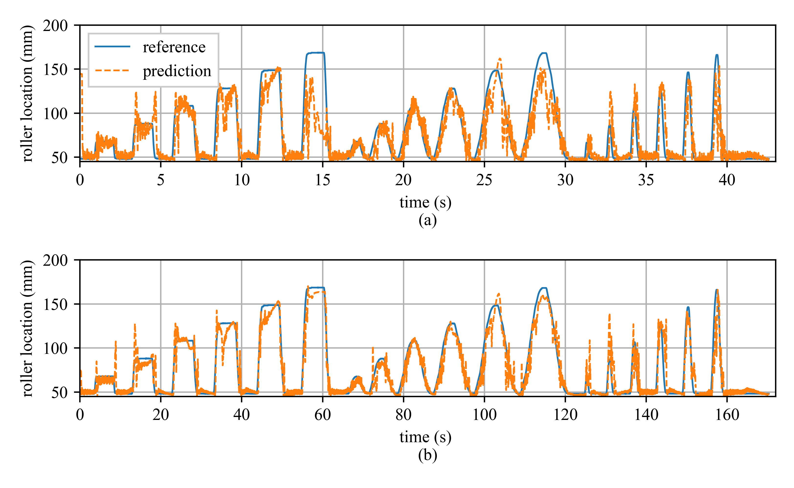
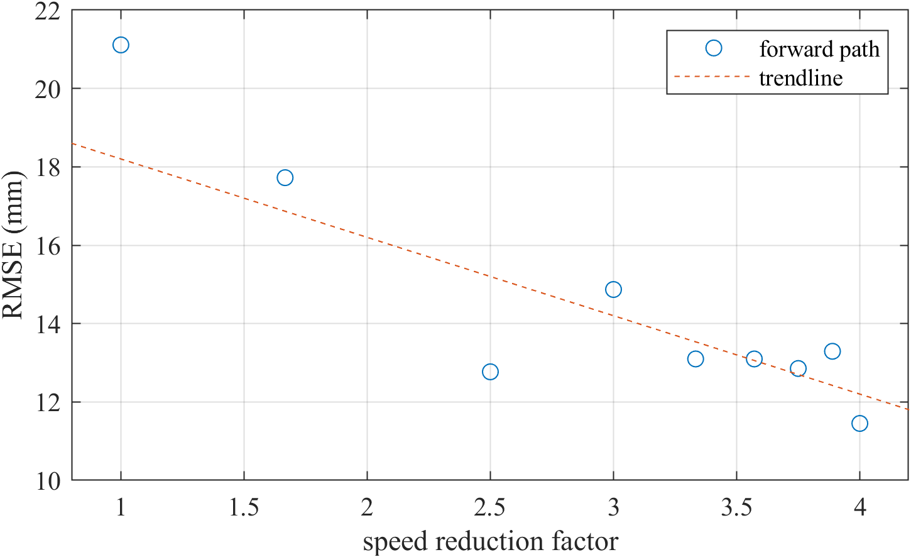

# Progress towards data driven high rate structural state estimation on edge computing devices
An long short-term memory (LSTM) model is implemented onto a real-time controller to predict system state from a synthesized time-series input.
## Hardware

Figure 1: Experimental setup and block diagram of data flow within the hardware.

## Results

Figure 2: Forward pass.

Figure 1: RMSE with varying speed reduction factor.

